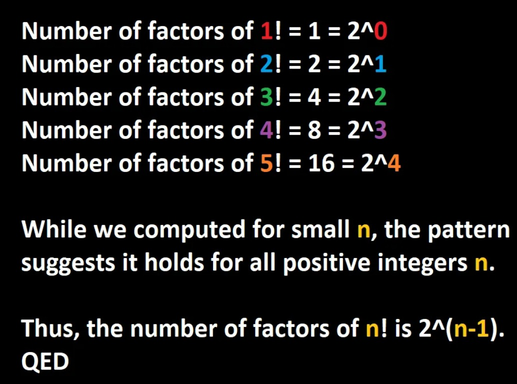

# Objetivos

# Objetivos

- Motivação para a disciplina.

- Apresentar os critérios de avaliação, ementa e bibliografia.

# Teste de software

- Abordagem padrão para garantia da qualidade em software.

# Teste de software

- Úteis para encontrar erros simples.

# Teste de software

- Uso de um grande número de testes é capaz de cobrir a maior parte do
  comportamento de programas.

# Teste de software

- Porém, como apontado por Dijkstra, testes apenas atestam a presença e nunca a
  ausência de bugs.

# Testes

- O uso de testes não é exclusividade da ciência da computação.

- Matemáticos usam testes como uma forma de validar sua intuição.

# Exemplo

- Suponha que um matemático descubra, usando métodos numéricos que:

$$
\int_{0}^{\infty}\dfrac{\sin(t)}{t}\mathrm{d} t = \dfrac{\pi}{2}
$$

# Exemplo

- Após algumas experimentações, ele supõe que:

$$
\int_{0}^{\infty}\dfrac{\sin(t)}{t}\dfrac{\sin(\frac{t}{101})}{\frac{t}{101}}\mathrm{d} t = \dfrac{\pi}{2}
$$

# Exemplo

- O próximo teste confirma que:

$$
\int_{0}^{\infty}\dfrac{\sin(t)}{t}\dfrac{\sin(\frac{t}{201})}{\frac{t}{201}}\mathrm{d} t = \dfrac{\pi}{2}
$$

# Exemplo

- Confiante, o matemático postula que:

$$
\forall n. n \in \mathbb{N} \to \int_{0}^{\infty}\dfrac{\sin(t)}{t}\dfrac{\sin(\frac{t}{100n + 1})}{\frac{t}{(100n + 1)}}\mathrm{d} t = \dfrac{\pi}{2}
$$

# Exemplo

- Porém, a confiança é logo derrotada pois para $n = 15$, a igualdade anterior
  não é válida.

# Testes

- Na matemática, testes são utilizados para ajudar na compreensão de problemas.

# Testes

- Para ter certeza de que uma propriedade de interesse é válida, matemáticos
  usam _demonstrações_.

# Testes e LLMs

- LLMs podem ajudar para construir essas demonstrações?

# Testes e LLMs

- LLMs tem exemplos bastante conhecidos de falhas colossais em raciocínio
  lógico.

# Testes e LLMs

- Considere o seguinte fato: O número de fatores em $n!$ é $2^{n - 1}$.

# Testes e LLMs

- Veja uma imagem (retirada do reddit) de uma "demonstração" realizada pelo Grok

# Testes e LLMs



# Testes e LLMs

- A propriedade falha para $n = 6$...

- Existem muitos outros casos de falhas bastante evidentes de LLMs em raciocínio
  lógico.

# Correção de programas

- De maneira similar, se desejamos garantir que um programa possui uma
  propriedade de interesse, devemos usar _demonstrações_ e não _testes_.

# Correção de programas

- Porém, quem garante que as provas estão corretas?

- Nos últimos anos, diversos trabalhos usam os chamados _assistentes de provas_
  para atestar a validade de demonstrações.

# Assistentes de provas

- Linguagens de programação que reduzem o problema de verificar demonstrações à
  tarefa de verificar tipos em um programa.

# Assistentes de provas

- Propriedades são expressas como tipos...

- Programas possuindo esses tipos correspondem a provas destas propriedades.

# Linguagem Lean

- Neste curso, utilizaremos a linguagem Lean, que pode ser entendida como uma
  linguagem funcional e um assistente de provas.

# Linguagem Lean

- Lean possui um sistema de tipos muito expressivo.
- Capaz de representar propriedades quaisquer da lógica.

# Linguagem Lean

- Logo, podemos especificar programas simplesmente usando um tipo capaz de
  representar sua propriedade de correção.

# Linguagem Lean

- Com isso, o compilador de Lean é capaz de verificar se a implementação do
  programa atende a sua especificação.

# Exemplo

- Uma função que retorna o predecessor de um número natural:

```lean
def pred (n : ℕ) : ℕ := 
  match n with 
  | .zero => 0
  | .succ n' => n'
```

# Exemplo

- O tipo anterior pode ser expresso em linguagens funcionais como Haskell ou ML.

# Exemplo

- Porém, esse tipo não é capaz de garantir que a função `pred` realmente
  implementa o predecessor de números naturais.

# Exemplo

- Expressando em lógica, temos:

$$
\forall n. n \in \mathbb{N} \to (n \neq 0 \to \exists m\,. n = m + 1) \lor n = 0
$$

# Exemplo

- Essa propriedade expressa como um tipo, seria:

```
def pred (n : ℕ) : {m : ℕ // n = m + 1} ⊕' (n = 0) := 
  open PSum in 
  match n with 
  | 0 => inr rfl 
  | n' + 1 => inl ⟨ n' , by simp ⟩
```

# Exemplo

- Usando o tipo anterior, o compilador de Lean garante que a implementação de
  `pred` satisfaz a propriedade:

$$
\forall n. n \in \mathbb{N} \to (n \neq 0 \to \exists m\,. n = m + 1) \lor n = 0
$$

# Aplicações

- Assistentes de provas tem sido usados com sucesso na verificação de diversas
  demonstrações não triviais.

# Aplicações

- Compiladores: CompCert
- Sistemas operacionais (seL4, certiKOS)
- Provas matemáticas: Teorema das 4 cores e Feith-Thompson.
- Verificação de protocolos financeiros.

# Informações Importantes

# Ementa

- Revisão de lógica e programação funcional.

- Noções de semântica formal.

- $\lambda$-cálculo atipado e tipado simples.

- Cálculo de construções.

# Ementa

- Introdução à linguagem Lean.

- Indução e recursão.

- Programação com tipos dependentes.

# Ementa

- Noções de semântica formal em Lean.

- Lógica de Hoare e de separação em Lean.

# Avaliação

- Listas de exercícios sobre o conteúdo abordado.

- Desenvolvimento de projeto e apresentação de seminário (pós-graduação).

# Avaliação

- Sobre o projeto:
  - Desenvolvimento de uma formalização em Lean de um tema de interesse do
    aluno.
  - Sujeito a aprovação pelo professor.
  - Apresentação na última semana do semestre.

# Avaliação

- Entregas esperadas do projeto:
  - Formalização em Lean do tema proposto.
  - Relatório, no formato de artigo científico, sobre a formalização
    desenvolvida.

# Avaliação

- Nota da gradução é a média aritmética simples da nota obtida nas listas de
  exercícios.

# Avaliação

- Nota da pós-graduação:
  - AP: Apresentação de seminário: 0, caso não apresente; 1 caso apresente.
  - NP: Nota do projeto desenvolvido.
  - NL: Nota das listas de exercícios.

$$
  AP \times NP \times 0,4 + NL \times 0,6
$$

# Software

- Utilizaremos a linguagem Lean.

- Editor de texto (recomenda-se Vim/Neovim, Emacs ou vscode).

- Slides produzidos usando pandoc e reveal.js.

# Material

- Código de exemplo e slides serão disponibilizados no seguinte repositório:

# Atendimento

- Atendimento também poderá ser feito por e-mail:

<rodrigo.ribeiro@ufop.edu.br>

# Bibliografia

- Christiansen, David T. Functional programming in Lean, 2023.
  - Disponível on-line em
    <https://lean-lang.org/functional_programming_in_lean/>.

# Bibliografia

- NEDERPELT, Rob; Geuvers, Herman. Type Theory and Formal Proof. Cambridge
  University Press, 2014.

# Bibliografia

- Artigos relevantes sobre os temas abordados na disciplina.

# Finalmente...

- Tenhamos todos um excelente semestre de trabalho!
