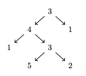

# Objetivos

- Revisar conceitos de programação funcional usando a linguagem Haskell.

- Apresentar noções de sistemas de tipos e sua relação com a lógica.

# Haskell

# Haskell

- Haskell é uma linguagem:
  - estaticamente tipada.
  - com avaliação não estrita.

# Haskell

- Haskell é estaticamente tipada.
- Isso quer dizer que toda expressão possui um tipo associado.

```haskell
wacky = not '1'
```

# Haskell

- Mensagem de erro:

```
• Couldn't match expected type ‘Bool’ with actual type ‘Char’
    • In the expression: not '1'
      In an equation for ‘wacky’: wacky = not '1'
   |
36 | wacky = not '1'
   |         ^^^^^^
```

# Haskell

- Mas, porquê desse erro?

- Primeiro, temos que:
  - `not :: Bool -> Bool`
  - `'1' :: Char`

# Haskell

- Logo, não é possível aplicar a função `not` a `'1'`.

- Motto: "Well-typed programs cannot go wrong!"

# Haskell

- Tipos primitivos
  - `Int`: 0, 1, -3 ...
  - `Char`: 'a', '1' ...
  - Ponto flutuante: Float, Double.

# Haskell

- Listas

```haskell
empty :: [a]
empty = []

oneTwo :: [Int]
oneTwo = [1, 2]
```

# Haskell

- Tuplas

```haskell
p0 :: ()
p0 = ()

p2 :: (Int, Char)
p2 = (0, 'a')

p3 :: (Int, Bool, String)
p3 = (-1, False, "")
```

# Haskell

- Declarações

```haskell
add2 :: Int -> Int
add2 n = n + 2
```

# Haskell

- Declarações

```haskell
data Pair a b = MkPair a b

sample :: Pair Int Bool
sample = MkPair 1 True
```

# Haskell

- Haskell é uma linguagem funcional: funções são objetos de primeira classe!

```haskell
map :: (a -> b) -> [a] -> [b]
map _ [] = []
map f (x : xs) = f x : map f xs
```

# Haskell

- Exemplo

```haskell
doubleAll :: [Int] -> [Int]
doubleAll = map (* 2)
```

```
$> doubleAll [1,2,3]
[2,4,6]
```

# Haskell

- Tipos recursivos.

```haskell
data Tree a
   = Leaf
   | Node a (Tree a) (Tree a)
```

# Haskell

- Considere a seguinte árvore binária.



# Haskell

- Representação usando o tipo `Tree`

```haskell
tree :: Tree Int
tree = Node 3 (Node 4 (Node 3 (Node 5 Leaf Leaf)
                              (Node 2 Leaf Leaf))
                      (Node 1 Leaf Leaf))
              (Node 1 Leaf Leaf)
```

# Haskell

- Definição de funções recursivas por casamento de padrão.

```haskell
height :: Tree a -> Int
height Leaf = 0
height (Node _ l r) = 1 + max (height l)
                              (height r)
```

# Haskell

- Haskell provê suporte ao chamado _polimorfismo paramétrico_.

- Adicionalmente, compiladores Haskell realizam inferência de tipos, permitindo
  omitir a maioria das anotações de tipos em funções.

# Exemplo

# Exemplo

- Vamos considerar a tarefa de implementar um interpretador para uma pequena
  linguagem de expressões.

- O interpretador será formado por dois componentes: um algoritmo para calcular
  o tipo de uma expressão e de sua execução.

# Exemplo

- Adicionalmente, esse exemplo servirá como base para o entendimento do
  funcionamento de assistentes de prova como Lean.

# Exemplo

- Linguagem considerada

$$
\begin{array}{lcl}
e & \to  & n \\
  & \mid & true\\
  & \mid & false\\
  & \mid & e + e\\
  & \mid & e == e\\
  & \mid & \textrm{if } e\textrm{ then } e \textrm{ else } e\\
\end{array}
$$

# Exemplo

- Representação da AST

```haskell
data Exp
  = ENum Int
  | ETrue | EFalse
  | EAdd Exp Exp
  | EEq Exp Exp
  | EIf Exp Exp Exp
```

# Exemplo

- De acordo com essa representação, o programa

```
if 1 == 3 then 2 else 5
```

é representado por:

```haskell
ex1 :: Exp
ex1 = EIf (EEq (ENum 1) (ENum 3))
          (ENum 2)
          (ENum 5)
```

# Exemplo

- Porém, é fácil notar que nem toda expressão deve possuir significado nessa
  linguagem.

- Considere a expressão:

```
true + 2
```

# Exemplo

- Para isso, vamos classificar as expressões utilizando tipos.

$$
\tau \to \textrm{int}\,|\,\textrm{bool}
$$

# Exemplo

- Representamos tipos de nossa linguagem por:

```haskell
data Ty = INT | BOOL
```

# Exemplo

- Sistema de tipos para a linguagem de expressões.

$$
\begin{array}{ccc}
   \dfrac{}{n : \textrm{int}}      & \dfrac{}{true : \textrm{bool}} & \dfrac{}{false : \textrm{bool}} \\ \\
\end{array}
$$

# Exemplo

- Sistema de tipos para a linguagem de expressões.

$$
\begin{array}{cc}
   \dfrac{e_1 : \textrm{int}\:\:\: e_2 : \textrm{int}}{e_1 + e_2 : \textrm{int}} &
   \dfrac{e_1 : \tau\:\:\: e_2 : \tau}{e_1 \textrm{ == } e_2 : \textrm{bool}}
\end{array}
$$

# Exemplo

- Sistema de tipos para a linguagem de expressões.

$$
\begin{array}{c}
\dfrac{e_1 : \textrm{bool}\:\:\:e_2 : \tau\:\:\:e_3 : \tau}
      {\textrm{if }e_1\textrm{ then }e_2\textrm{ else } e_3 : \tau}
\end{array}
$$

# Exemplo

- Mostrando que a expressão

`if 1 == 3 then 5 else 3`

é correta.

$$
\dfrac{\dfrac{\dfrac{}{1 : \textrm{int}}
              \:\:\:
              \dfrac{}{3 : \textrm{int}}}
             {1 == 3 : \textrm{bool}}
       \:\:\:
       \dfrac{}{5 : \textrm{int}}
       \:\:\:
       \dfrac{}{3 : \textrm{int}}}
      {\textrm{if }1 == 3 \textrm{ then } 5 \textrm{ else } 3 : \textrm{int}}
$$

# Exemplo

- Verificando se uma expressão está correta de acordo com o sistema de tipos.

\begin{code} tc :: Exp -> Maybe Ty tc (ENum _) = return INT tc ETrue = return
BOOL tc EFalse = return BOOL \end{code}

# Exemplo

- Continuação...

```haskell
tc (EAdd e1 e2) = do 
  t1 <- tc e1 
  t2 <- tc e2 
  case (t1, t2) of 
    (INT, INT) -> return INT 
    _ -> fail "type error"
```

# Exemplo

- Continuação ...

```haskell
tc (EEq e1 e2) = do 
  t1 <- tc e1 
  t2 <- tc e2 
  if t1 == t2 then return BOOL 
  else fail "type error"
```

# Exemplo

- Continuação ...

```haskell
tc (EIf e1 e2 e3) = do 
  t1 <- tc e1 
  t2 <- tc e2 
  t3 <- tc e3 
  if t1 == BOOL && t2 == t3 then return t2 
  else fail "type error"
```

# Exemplo

- Para implementar o interpretador, precisamos de um tipo para representar os
  valores (resultados) de expressões.

```haskell
data Val = VInt Int | VBool Bool
```

# Exemplo

- Para facilitar, vamos criar funções auxiliares para implementar o
  interpretador.

# Exemplo

- Somando valores

```haskell
addVal :: Val -> Val -> Maybe Val 
addVal (VInt n1) (VInt n2) 
    = return $ VInt (n1 + n2) 
addVal _ _ = Nothing
```

# Exemplo

- Comparando valores

```haskell
eqVal :: Val -> Val -> Maybe Val 
eqVal (VInt n1) (VInt n2) 
   = return $ VBool (n1 == n2) 
eqVal (VBool b1) (VBool b2) 
   = return $ VBool (b1 == b2) 
eqVal _ _ = Nothing
```

# Exemplo

- Testando se um valor é verdadeiro

```haskell
valTrue :: Val -> Bool 
valTrue v = v == VBool
```

# Exemplo

- Intepretador

```haskell
interp :: Exp -> Maybe Val 
interp (ENum n) = return (VInt n) 
interp ETrue = return (VBool True) 
interp EFalse = return (VBool False)
```

# Exemplo

- Continuação...

```haskell
interp (EAdd e1 e2) = do 
   v1 <- interp e1 
   v2 <- interp e2 
   addVal v1 v2
```

# Exemplo

- Continuação...

```haskell
interp (EEq e1 e2) = do 
   v1 <- interp e1 
   v2 <- interp e2 
   eqVal v1 v2
```

# Exemplo

- Continuação...

```haskell
interp (EIf e1 e2 e3) = do 
   v1 <- interp e1 
   if valTrue v1 then interp e2 
   else interp e3
```

# Exemplo

- Isso conclui o nosso exemplo inicial de um interpretador.

# Lógica

# Lógica

- Haskell possui um sistema de tipos suficientemente expressivo para expressar
  fatos simples da lógica proposicional.

# Lógica

- De maneira intuitiva, podemos entender tipos polimórficos formados apenas por
  variáveis e tipos funcionais como tautologias da lógica proposicional.

# Lógica

- Exemplo: A seguinte fórmula é uma tautologia da lógica proposicional.

$$
(B \to C) \to (A \to B) \to (A \to C)
$$

# Lógica

- A tautologia anterior pode ser provada pelo seguinte argumento:

- Suponha que $B \to C$ e $A \to B$. Suponha que $A$.
  - Como $A \to B$ e $A$ temos que $B$.
  - Como $B \to C$ e $B$ temos que $C$.
- Portanto, $A \to C$.

# Lógica

- O argumento anterior pode ser representado como uma função Haskell.

# Lógica

- A fórmula

$$
(B \to C) \to (A \to B) \to (A \to C)
$$

- pode ser representada pelo seguinte tipo em Haskell.

```haskell
comp :: forall a b c. (b -> c) -> (a -> b) -> (a -> c)
comp bc ab a = _
```

# Lógica

- Uma expressão Haskell com esse tipo tem a mesma estrutura da demonstração.

# Lógica

- Representando a demonstração como código:

- Suposições são representadas como variáveis.

# Lógica

- As suposições $B \to C$ e $A \to B$ serão representadas pelas variáveis `bc` e
  `ab`, respectivamente

```haskell
comp :: forall a b c. (b -> c) -> (a -> b) -> (a -> c)
comp bc ab = _
```

# Lógica

- A suposição $A$ é representada pela variável `a`:

```haskell
comp :: forall a b c. (b -> c) -> (a -> b) -> (a -> c)
comp bc ab a = _
```

# Lógica

- Podemos representar a dedução de $B$ a partir de $A \to B$ e $A$, como uma
  aplicação de função.

```haskell
comp :: forall a b c. (b -> c) -> (a -> b) -> (a -> c)
comp bc ab a
   = let
       pb :: b
       pb = ab a
     in _
```

# Lógica

- Finalmente, podemos deduzir $C$, a partir de $B \to C$ e $C$:

```haskell
comp :: forall a b c. (b -> c) -> (a -> b) -> (a -> c) 
comp bc ab a
   = let 
       pb :: b 
       pb = ab a 
     in bc pb
```

# Lógica

- Podemos então usar Haskell para desenvolver programas e demonstrações sobre
  estes?

# Lógica

- Não! Apesar de expressiva, Haskell não impõe restrições importantes para
  interpretar quaisquer programas como demonstrações.

# Lógica

- Haskell permite usar:
  - Exceções
  - Não terminação de programas

# Lógica

- Uso de exceções para definir funções independentemente do tipo.

```haskell
cheat :: forall a. a 
cheat = error "Cheating..."

absurd :: forall a b. a -> b 
absurd = cheat
```

# Lógica

- Uso de não terminação

```haskell
loop :: forall a . a 
loop = loop
```

# Lógica

- Para desenvolvermos demonstrações sem incorrer no risco de trapaças, devemos
  usar linguagens que as evitem.

# Lógica

- Atualmente, existem diversos _assistentes de provas_ que possuem um sistema de
  tipos expressivos e evitam os problemas de Haskell.
  - Exceções.
  - Permitir não terminação.

# Lógica

- Para isso, neste curso vamos utilizar a linguagem Lean para desenvolvimento de
  demonstrações.

# Referências

- Lipovaca, Miran. Learn You a Haskell for Great Good. No Starch Press, 2011.
  Disponível on-line: <http://learnyouahaskell.com/>

- Pierce, Benjamin. Types and Programming Languages. MIT Press, 2002.
